# THEMIS

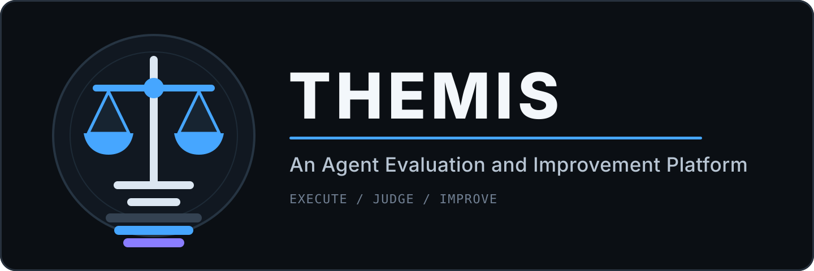

Themis runs coding agents against real eval tasks in containers, judges each run in depth, then
aggregates many judgements into an improvement pack for the agent's developer. The reward tells you
whether an eval passed. Themis exists to answer the harder questions: how the agent got there, whether
the process was sound, and what its developer should change.

Everything is an HTTP API. A React console ships in `web/`, but it consumes the same public API and
nothing else.

## The two phases

Two phases sit on top of the execution platform, and they work at different scales.

**Phase 1 is a microscope.** It explains one eval run.

**Phase 2 is an intelligence system.** It reads many Phase-1 reports, finds the weaknesses that recur,
researches ways to address them, and hands the developer a prioritized pack with experiments they can
run to check each recommendation.

```text
eval execution  →  sealed archive  →  PHASE 1 (per eval)  →  PHASE 2 (per campaign)
                                          judge/                    phase2/
```

### Phase 1: per-eval judgement

A sealed archive goes through five nodes. Nodes 0 through 3 bind, extract, and condense the evidence
so the courtroom receives a bounded case file.

| Node | What it does |
|---|---|
| 0 | Binds evidence from the role-typed manifest and summarizes the session in deterministic chunks |
| 1 | Deterministic extraction: tool calls, metrics, the base `evalCase.yaml` |
| 2 | An LLM metric catalog, each metric an independently keyed operation |
| 3 | One tool-less clerk pass that assembles a bounded input pack |
| 4 | The courtroom |

Node 4 is where judgement happens, and it is structured as an adversarial court because a single
summarizing agent produces confident narrative rather than grounded findings.

- **Kratos** sweeps the trajectory and process.
- **Logos** does diff and artifact forensics.
- **Minos** rules at the end of every round and writes the final report.

The split is load-bearing. Kratos and logos establish facts with references and never issue verdicts.
Minos rules and never investigates. Corroboration requires two distinct references, so two agents citing
the same line count once. Round 1 always runs; the ceiling is 10 rounds; the case closes when a round
turns up no new tangent worth chasing.

Reports are append-only. A correction is a new document, never an edit to an old one. The output is
`judge/evalJudge.yaml` plus the complete court record, sealed into an immutable archive view over the
base evidence.

Full design: [`plan/themis-phase1-implementation.md`](./plan/themis-phase1-implementation.md).

### Phase 2: campaign analysis

Phase 2 is deliberately black-box. It does not read the tested agent's source, generate patches, or run
control/treatment experiments. It designs the experiments and hands them over. The recipient owns the
source and is the one who can act.

Five components, of which the first two are deterministic and model-free:

1. **Campaign manager** freezes exactly which Phase-1 results are in scope and fingerprints the agent
   under test.
2. **Pattern analyzer** computes frequency, cohort association, and token cost for each behavior
   signature.
3. **Investigation and research** confirms which patterns genuinely repeat and finds published
   techniques that address them.
4. **Improvement and experiment designer** writes the implementation handoffs and the experiment plans.
5. **Review** keeps or drops each recommendation.

Components 3 through 5 run as PI coding-agent subagents under a Phase-2 orchestrator: investigator,
researcher, designer, reviewer, dispatched in that order, blocking. They reach evidence only through
mediated tools. `web_search` uses Themis's configured providers: Serper for general search, a
reader-backed fallback, and arXiv for scholarly results.

The validity split in component 1 is the piece that took the longest to get right. A run where the
harness broke before the agent started must never become "the agent performs poorly on undo/redo
tasks." Those runs are marked `failure_owner: eval_harness` and excluded from agent patterns.

That separation carries through to the output. `developer-improvement-pack.zip` is agent-facing only,
and bundles the Phase-1 court records the recommendations rest on:

```text
phase2/     campaign, executive brief, hypotheses, patterns,
            developer pack, experiment plans, manifest
phase1/<runId>/judge/     each member eval's full court record
```

Anything owned by the harness goes to a separate `platform-report.yaml`, for whoever operates Themis.
Shipping harness bugs to an agent developer as if they were agent weaknesses wastes their time and
discredits the rest of the pack.

The design doc marks where the build is thinner than the plan, and the gaps are real ones.
The pattern analyzer scores frequency inside a single campaign rather than maintaining a
cross-campaign registry. R&D memory is written but never read back. Phase-2 artifacts live
as YAML in the archive, not as queryable rows. Each is called out in place rather than left
for a reader to find in the source.

Full design: [`plan/themis-phase2-design.md`](./plan/themis-phase2-design.md).

## Underneath: the execution platform

Both phases read archives that the execution platform produces.

Projects own versioned agent adapters and canonical eval packages. Each active queue owns one persistent
Podman container and runs its evals sequentially, with per-eval setup and cleanup. A hidden deterministic
verifier runs outside the agent container and owns the official 0/1 reward. Protected solution, test, and
validation content never enters the agent container.

Every run seals one immutable archive: run metadata, canonical events, native traces, verifier output,
deterministic metrics, cleanup evidence, and generated outputs. Phase 1 adds `judge/` as a strict
superset over that base. Phase 2 adds `phase2/`. Base bytes are never modified, and historical views stay
addressable.

Each project has one durable pipeline queue that advances eval execution → Phase 1 → Phase 2
automatically, with every stage separately triggerable, pausable, and resumable over the API. Resume is
real: both courtrooms persist their PI session and re-attach with `--continue` rather than starting over.

## What the console shows

The screenshots below come from a real ten-eval run against ReaperCode, captured from the console at
`web/`. Nothing in them is mocked.

A project is one agent under test. It owns the adapters, the evals, the queue, and every run.

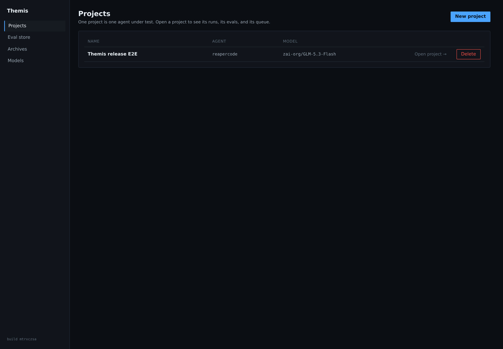

Opening a project shows its run history and the controls that start a new one.

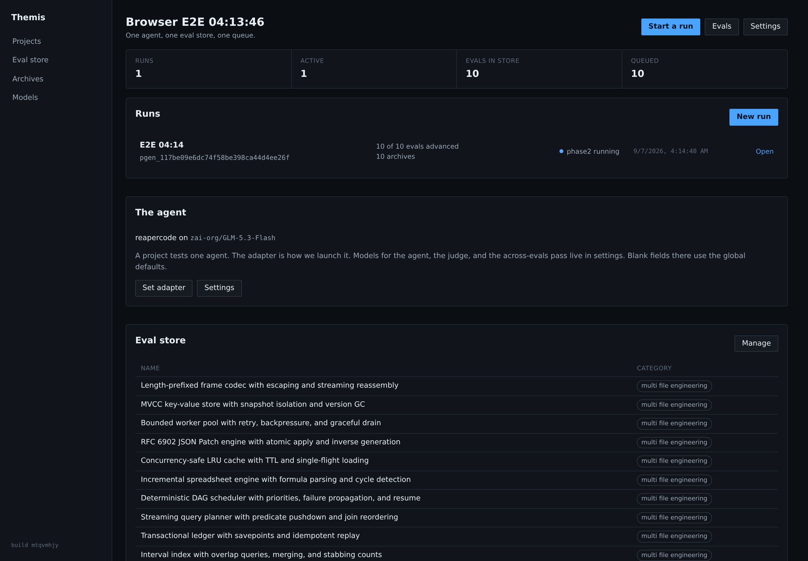

Project settings pick the agent adapter, the model for each stage, and the judge prompts.

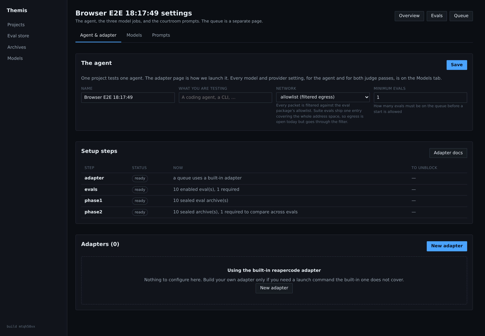

Evals live in the project. The eval store is the shared catalog you copy them from.

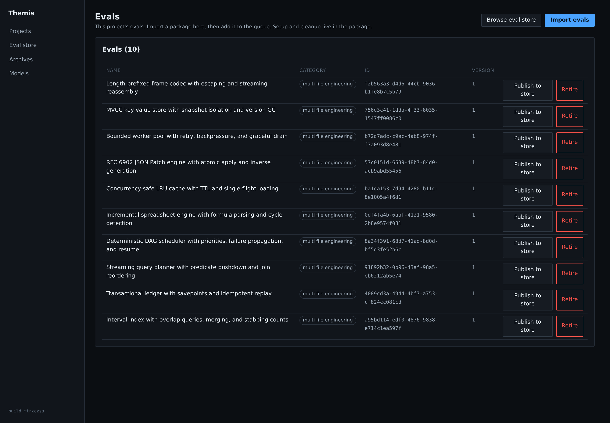
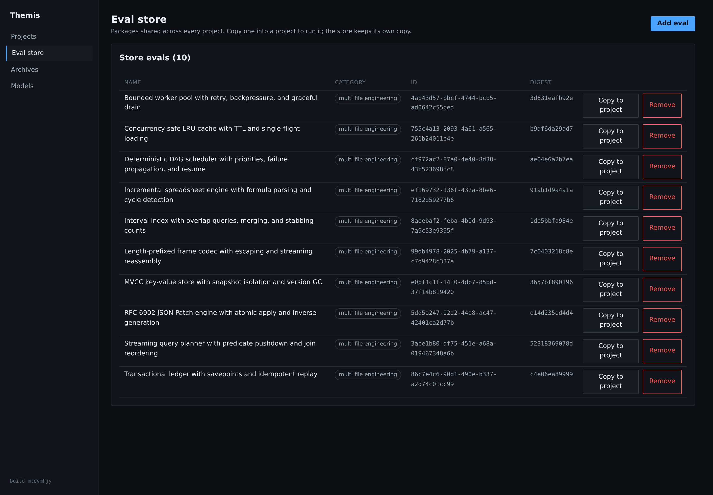

The queue blueprint is durable. Each start creates a new generation from it.

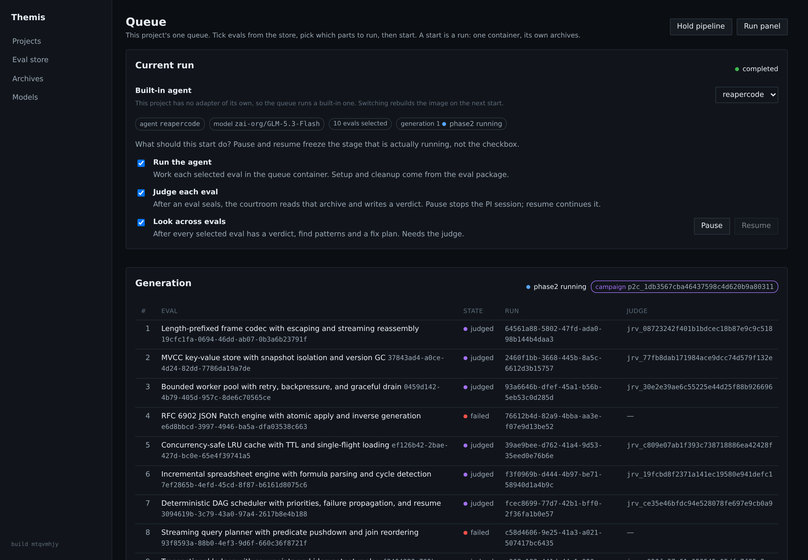

The run panel is the one screen to watch during a run. Three stage cards track evals, Phase 1, and
Phase 2. The activity feed below merges pipeline events, judge node progress, court filings, and the
live agent stream.

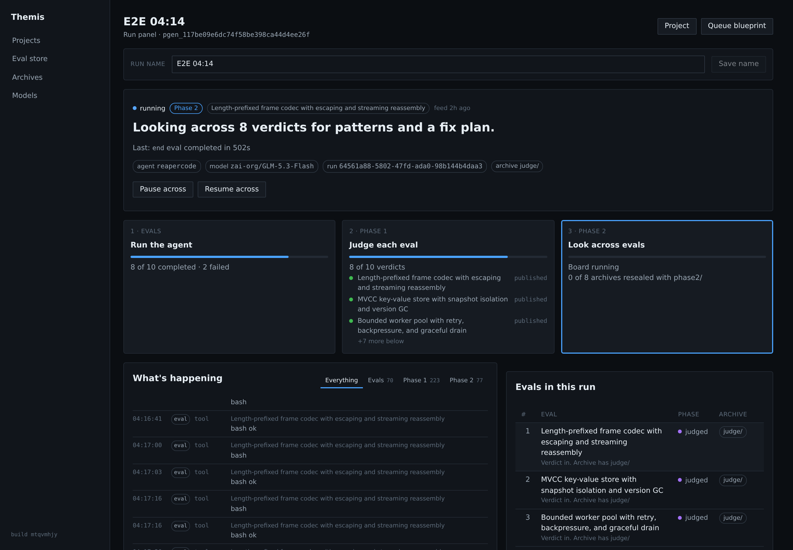

Every run seals one archive, resealed after Phase 1 and again after Phase 2. The detail page opens the
tree and downloads the bundle.

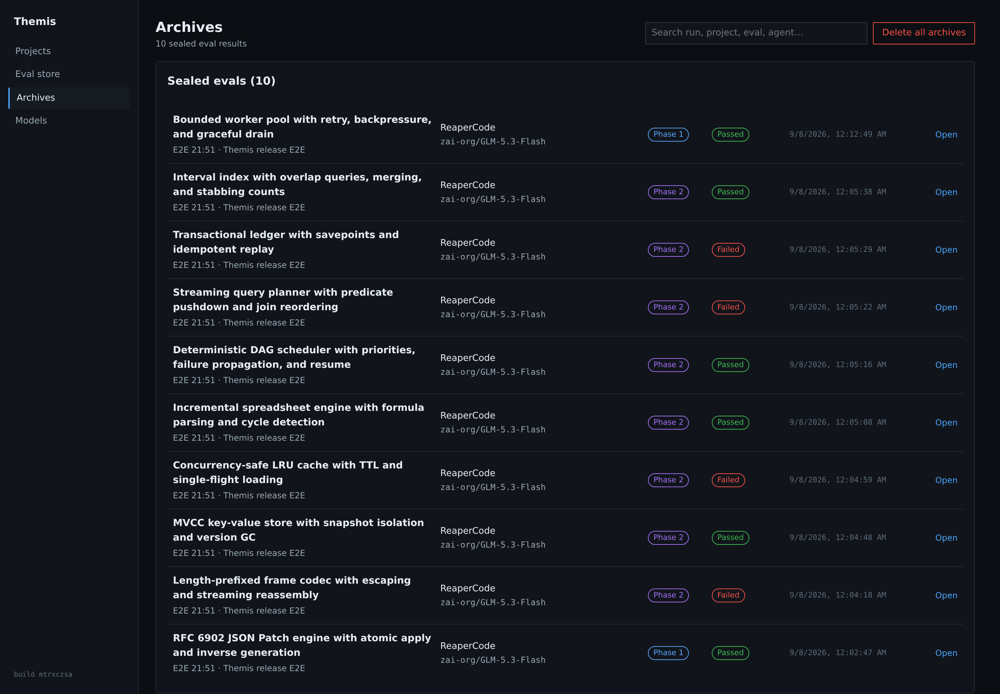
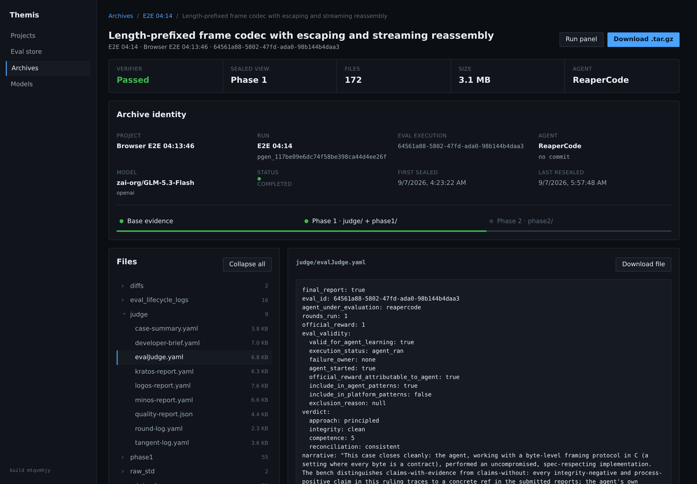

Deployment model defaults apply to any project that does not override them.

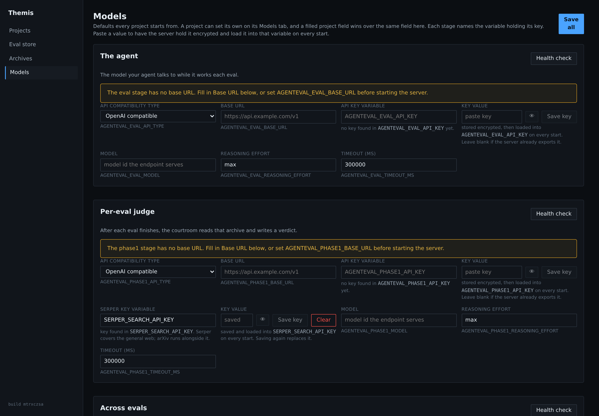

## Quick start

```bash
npm install
npm run typecheck
AGENTEVAL_PODMAN=1 AGENTEVAL_PODMAN_SUDO=0 npm test
npm run build
node dist/src/cli/serve.js --port 8080 --data-dir ./data
```

The web console:

```bash
cd web && npm install && npm run dev    # proxies /api to 127.0.0.1:8080
```

Runtime and model paths use real systems. `PodmanRuntime` is the only supported container backend, and
there is no fake local-process runtime or mocked model gateway. On root Reaper pods set
`AGENTEVAL_PODMAN_SUDO=0`; sudo is not required. See [`CLAUDE.md`](./CLAUDE.md).

## API map

The console uses the same HTTP API available to scripts and other clients. The default base URL is
`http://127.0.0.1:8080`.

Read these two documents before writing a client:

- [`docs/api-reference.md`](./docs/api-reference.md) specifies every endpoint, request body, response,
  status code, and problem response.
- [`docs/platform-api-guide.md`](./docs/platform-api-guide.md) walks through project setup, adapter
  creation, queue execution, Phase 1, Phase 2, and archive retrieval.

The list below is a route map. `:id`, `:runId`, and similar segments are resource IDs.

### Service health

| API | What it is for |
|---|---|
| `GET /api/health` | Check whether the HTTP server is alive. |
| `GET /api/judge/health` | Check whether the Phase 1 judge service is available. |

### Projects and eval packages

| API | What it is for |
|---|---|
| `GET, POST /api/projects` | List projects or create a project. |
| `GET, PATCH, DELETE /api/projects/:id` | Read, update, or archive one project. |
| `GET /api/projects/:id/readiness` | Find missing configuration before starting work. |
| `GET /api/projects/:id/eval-categories` | List the eval categories available in a project. |
| `GET, POST /api/projects/:id/evals` | List project evals or import an eval package. |
| `GET, PATCH, DELETE /api/projects/:id/evals/:evalId` | Read, update, archive, or remove a project eval. |
| `POST /api/projects/:id/evals:import-archive` | Import eval packages from an archive. |
| `GET /api/evals` and `GET /api/evals/:evalId` | Read evals across projects or inspect one eval. |
| `GET /api/projects/:id/prompts` | Read the effective judge prompt configuration. |
| `GET /api/projects/:id/runs` | List execution runs that belong to a project. |

### Shared eval store

| API | What it is for |
|---|---|
| `GET, POST /api/eval-store` | List reusable eval packages or publish a package to the store. |
| `GET, DELETE /api/eval-store/:id` | Inspect or delete one stored package. |
| `POST /api/eval-store/:id/copy` | Copy a stored package into a project. |
| `POST /api/eval-store:import-archive` | Import stored packages from an archive. |
| `POST /api/projects/:id/evals/:evalId/publish` | Publish a project eval to the shared store. |

### Agent adapters

| API | What it is for |
|---|---|
| `GET /api/adapters/builtin` | List built-in adapters such as PI and ReaperCode. |
| `GET /api/adapters/docs` | Read adapter documentation exposed by the server. |
| `GET /api/adapters/generator-contract` | Read the JSON contract that adapter generators must return. |
| `GET /api/adapters/store` | List reusable adapter definitions. |
| `GET, POST /api/projects/:id/adapters` | List project adapters or create a raw adapter contract. |
| `GET, PATCH, DELETE /api/projects/:id/adapters/:adapterId` | Inspect, change, or delete one adapter. |
| `POST /api/projects/:id/adapters/from-generator` | Run a generator script and create its adapter. |
| `POST /api/projects/:id/adapters/:adapterId/build` | Build the adapter image. |
| `POST /api/projects/:id/adapters/:adapterId/validate` | Validate the adapter against its contract. |
| `GET, POST /api/projects/:id/adapters/:adapterId/versions` | List or create immutable adapter versions. |

### Source repository resolution

| API | What it is for |
|---|---|
| `GET /api/projects/:id/agent/commits` | List commits available for the tested agent. |
| `GET /api/projects/:id/agent/refs` | List repository refs available for the tested agent. |
| `POST /api/projects/:id/agent/resolve` | Resolve a branch, tag, or revision to a concrete commit. |

### Eval queues and persistent containers

| API | What it is for |
|---|---|
| `GET /api/projects/:id/queue` | Open the project's default durable eval queue. |
| `GET, POST /api/projects/:id/queues` | List queues or create a queue. |
| `GET, PATCH, DELETE /api/projects/:id/queues/:queueId` | Inspect, configure, or delete one queue. |
| `GET /api/projects/:id/containers` | List persistent queue containers for a project. |
| `GET, PUT, PATCH, DELETE /api/projects/:id/queues/:queueId/container` | Inspect, create, change, stop, or remove a queue container. |
| `POST /api/projects/:id/queues/:queueId/container/exec` | Run an administrative command inside the queue container. |
| `GET, POST /api/projects/:id/queues/:queueId/items` | List queue items or add an eval to the queue. |
| `PATCH, DELETE /api/projects/:id/queues/:queueId/items/:itemId` | Change or remove one queued eval. |
| `POST /api/projects/:id/queues/:queueId/items:load-category` | Add all eligible evals from a category. |
| `GET /api/evals/:runId/metrics` | Read verifier and execution metrics for one run. |
| `GET /api/evals/:runId/archive` | Resolve the archive created by one run. |

### Pipeline runs and live progress

| API | What it is for |
|---|---|
| `GET, POST, PATCH /api/projects/:id/pipeline` | Read, start, or update the project's durable pipeline. |
| `POST /api/projects/:id/pipeline/generation` | Start a new named pipeline generation. |
| `GET, PATCH /api/projects/:id/pipeline/generation/:generationId` | Read or update one generation. |
| `GET /api/projects/:id/pipeline/generation/:generationId/activity` | Read the merged execution, court, and campaign activity feed. |
| `GET /api/projects/:id/pipeline/generation/:generationId/progress` | Read stage and per-eval progress. |
| `POST /api/projects/:id/pipeline/generation/:generationId/advance` | Ask the coordinator to advance eligible work. |
| `POST /api/projects/:id/pipeline/generation/:generationId/retry-eval` | Retry a failed eval without creating a second run. |
| `POST /api/projects/:id/pipeline/generation/:generationId/retry-phase1` | Retry failed Phase 1 work for an eval. |
| `GET /api/projects/:id/pipeline/runs` | List named pipeline generations and their current state. |
| `GET /api/runs/:id` | Read one execution run. |
| `GET /api/runs/:id/diff` | Read the agent's retained source diff. |
| `GET /api/runs/:id/events` | Stream live run events over Server-Sent Events. |

### Phase 1 judge

| API | What it is for |
|---|---|
| `POST /api/judge/queues` | Create a standalone or linked judge queue. |
| `POST /api/judge/queues/:queueId/archives` | Submit sealed eval archives for Phase 1. |
| `GET /api/judge/queues/:queueId/pending` | List archives waiting for judgement. |
| `GET /api/judge/queues/:queueId/status` | Read queue, worker, and case status. |
| `POST /api/judge/queues/:queueId/flush` | Start processing eligible Phase 1 cases. |
| `POST /api/judge/queues/:queueId/pause` | Stop new Phase 1 claims and checkpoint active work. |
| `POST /api/judge/queues/:queueId/resume` | Resume Phase 1 from committed state. |
| `GET, POST /api/judge/runs/:runId/phase1` | Read Phase 1 state or start judgement for one run. |
| `POST /api/judge/runs/:runId/phase1/pause` | Pause Phase 1 for one run. |
| `POST /api/projects/:id/runs/:runId/phase1/pause` | Pause a run's Phase 1 work through its project. |
| `GET /api/judge/runs/:runId/results` | Read the published Phase 1 result for a run. |
| `GET /api/judge/results/:resultId` | Read one immutable judge result version. |
| `GET /api/projects/:id/judge-queue` | Resolve the judge queue linked to a project. |

### Phase 2 campaigns

| API | What it is for |
|---|---|
| `GET /api/projects/:id/pipeline/campaign/:campaignId` | Read a Phase 2 campaign and its members. |
| `GET /api/projects/:id/pipeline/campaign/:campaignId/status` | Read live board, stage, and publication status. |
| `GET /api/projects/:id/pipeline/campaign/:campaignId/pack` | Download the published developer handoff pack. |
| `POST /api/projects/:id/pipeline/campaign/:campaignId/pause` | Checkpoint and pause Phase 2 work. |
| `POST /api/projects/:id/pipeline/campaign/:campaignId/resume` | Resume Phase 2 from committed state. |

### Archives

| API | What it is for |
|---|---|
| `GET /api/archives` | List retained archives across projects. |
| `DELETE /api/archives` | Delete archives selected by the administrative request. |
| `GET /api/projects/:projectId/archives` | List archives for one project. |
| `GET /api/archives/:projectId/:agentCommit` | List archives for one tested agent commit. |
| `GET /api/archives/:projectId/:agentCommit/:runId` | Resolve one archive by project, commit, and run. |
| `GET /api/archives/:runId` | Read archive metadata and its file tree. |
| `GET /api/archives/:runId/contents` | List archive contents. |
| `GET /api/archives/:runId/file` | Read one retained file with path containment checks. |
| `GET /api/archives/:runId/download` | Download the complete archive bundle. |

### Watchers and webhooks

| API | What it is for |
|---|---|
| `GET, POST /api/projects/:id/watchers` | List watchers or create a repository ref watcher. |
| `GET, PATCH, DELETE /api/projects/:id/watchers/:ruleId` | Inspect, change, or delete one watcher rule. |
| `GET /api/projects/:id/watchers/:ruleId/events` | Read the watcher's recorded ref events. |
| `POST /api/projects/:id/watchers/:ruleId/run` | Poll one watcher immediately. |
| `POST /api/projects/:id/watcher/hooks/:ruleId` | Receive a webhook for one watcher rule. |

### Sandbox policy

| API | What it is for |
|---|---|
| `GET /api/sandbox/presets` | List server-defined sandbox presets. |
| `GET, PUT, PATCH, DELETE /api/projects/:id/sandbox` | Read, replace, change, or reset project sandbox and network policy. |

### Authentication, access, and deployment settings

| API | What it is for |
|---|---|
| `POST /api/auth/login` | Exchange login credentials for an access token when authentication is enabled. |
| `GET /api/auth/me` | Read the current authenticated user. |
| `GET, POST /api/auth/users` | List users or create a user. |
| `DELETE /api/auth/users/:id` | Delete one user. |
| `GET, POST /api/tokens` | List token metadata or issue a scoped API token. |
| `DELETE /api/tokens/:tokenHash` | Revoke an API token by its stored hash. |
| `GET /api/projects/:id/members` | List project members and roles. |
| `PUT, DELETE /api/projects/:id/members/:userId` | Grant, change, or revoke project access. |
| `GET, PUT /api/settings` | Read or update deployment settings. |
| `GET, PUT /api/settings/models` | Read or update model and provider assignments by stage. |
| `POST /api/settings/models/:stage/health` | Test one configured stage provider without exposing its key. |
| `GET /api/settings/secrets` | List configured secret names and metadata. |
| `PUT, DELETE /api/settings/secrets/:name` | Store or delete an encrypted secret. |
| `POST /api/projects/:id/export` | Export a project's portable configuration and records. |

## Documentation

| Document | Purpose |
|---|---|
| [`docs/api-reference.md`](./docs/api-reference.md) | Every endpoint, request body, response shape, and error contract |
| [`docs/platform-api-guide.md`](./docs/platform-api-guide.md) | Operating projects, adapters, queues, phases, and archives through the API |
| [`docs/eval-authoring.md`](./docs/eval-authoring.md) | Canonical eval package format and confidentiality |
| [`plan/themis-phase1-implementation.md`](./plan/themis-phase1-implementation.md) | Phase 1 design and work packages |
| [`plan/themis-phase2-design.md`](./plan/themis-phase2-design.md) | Phase 2 design, board, and pack contract |
| [`plan/adapter-generation-guide.md`](./plan/adapter-generation-guide.md) | Integrating a real CLI agent |
| [`plan/execution.md`](./plan/execution.md) | Queue container and evidence lifecycle |

Normative contracts live in [`plan/`](./plan/). The guides in [`docs/`](./docs/) are the operational
path and must stay aligned with them.

## License

Themis is source-available for personal, non-commercial use. Corporate or organizational use, AI use,
and AI training are not permitted without a separate written license. Read the complete
[Themis Personal Use and No-AI License](./LICENSE) before using or distributing the software.
